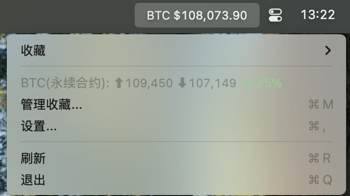
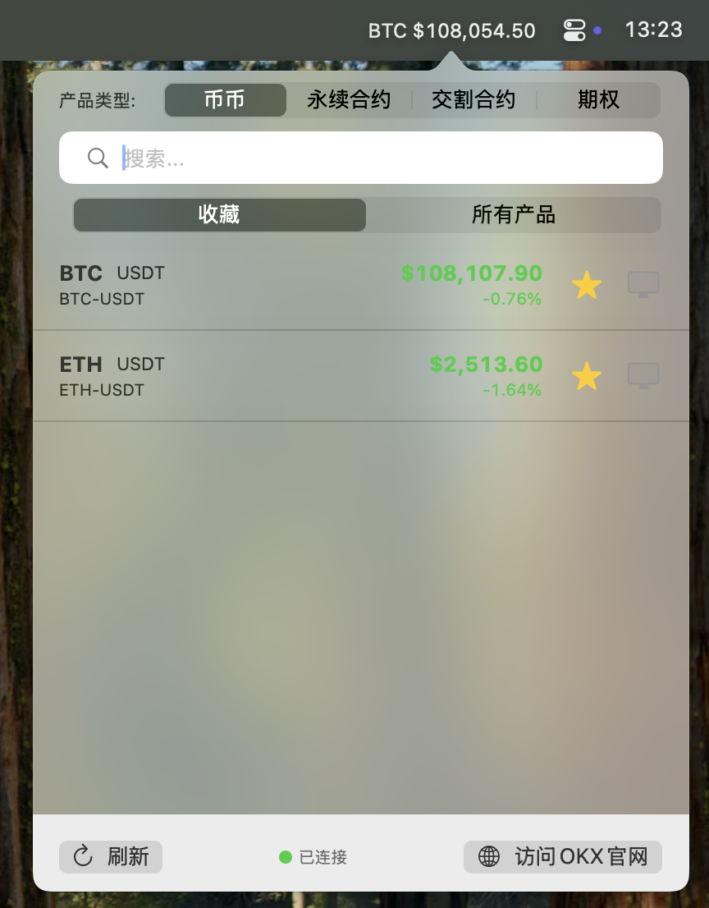

# CryptoStatusBar - macOS Cryptocurrency Price Viewer

[](README.md) [](README_EN.md)

CryptoStatusBar is a lightweight macOS menu bar application that displays real-time cryptocurrency price information. It uses the official OKEx exchange API to fetch data, allowing users to check the prices of their favorite cryptocurrencies directly from the menu bar without opening a browser.




## Key Features

- **Menu Bar Display**: Real-time cryptocurrency prices in the macOS top menu bar
- **Live Data**: Get real-time price updates through OKEx official API WebSocket connection
- **Customizable Display**: Customize currency units, decimal places, and compact mode
- **Favorites Management**: Add, remove, and reorder your favorite cryptocurrencies
- **Price Notifications**: Receive system notifications when price changes exceed your set threshold
- **Dark Mode**: Support for system dark/light mode or manual switching
- **Launch at Login**: Option to automatically run at system startup

## System Requirements

- macOS 12.0 (Monterey) or higher
- Internet connection for real-time price data

## Installation Methods

### Method 1: Using Launch Script (Recommended)

1. Double-click the `build_app.sh` script (or execute `./build_app.sh` in terminal) to build the application
2. After building, execute the `./launch.sh` script to start the application
3. The application will run in the background; check the top menu bar to see the cryptocurrency price

### Method 2: Launch by Double-Clicking the Application Icon

1. Double-click the `build_app.sh` script to build the application
2. After building, a `CryptoStatusBar.app` application package will be generated
3. Right-click (or Control+click) `CryptoStatusBar.app` and select "Open"
4. Select "Open" again in the dialog box that appears

### Method 3: Run the Executable File Directly Through Terminal

If you encounter any startup issues, you can try running the executable file directly:

```
./CryptoStatusBar.app/Contents/MacOS/CryptoStatusBar
```

## Usage Instructions

### Basic Operations

1. After the application starts, the current price of the selected cryptocurrency will be displayed in the menu bar at the top of the screen
2. Click on the menu bar icon to view the dropdown menu, which contains the following options:
   - **Favorites**: Display your list of favorite cryptocurrencies
   - **Price Details**: Show 24-hour price movement information for the currently selected cryptocurrency
   - **Manage Favorites**: Open the product list window to add or remove favorites
   - **Settings**: Open the settings window to customize the application behavior
   - **Refresh**: Manually update price data
   - **Quit**: Close the application

### Managing Favorites

1. Click the "Manage Favorites..." option to open the product list window
2. In the window, you can switch between the "Favorites" and "All Products" tabs
3. Click the star icon next to a product to add or remove it from favorites
4. For favorited products, click the display icon to set it as the product displayed in the menu bar

### Application Settings

Click the "Settings..." option to open the settings window, where you can configure the following options:

1. **Display Settings**
   - Compact Mode: Reduce the font size in the menu bar display
   - Decimal Places: Set the number of decimal places for price display
   - Show Currency Unit: Choose to display USD, CNY, or no currency unit
   - Price Change Colors: Set whether to use colors to identify price changes

2. **Appearance**
   - Use System Appearance: Follow the system's dark/light mode
   - Dark Mode: Manually set dark mode (only available when not using system appearance)

3. **Notification Settings**
   - Significant Price Change Notifications: Send notifications when price changes exceed the threshold
   - Change Threshold: Set the threshold for price change notifications

4. **Data Refresh**
   - Refresh Interval: Set the time interval for automatic price data refresh
   - Show Network Status Indicator: Display network connection status in the menu bar

5. **System Settings**
   - Launch at Login: Set whether the application automatically runs at system startup
   - Reset All Settings: Restore all settings to default values
   - Clear All Data: Clear all settings and favorite data

## Troubleshooting

### "Application is Damaged" Error

If you see "Application is damaged" or "Cannot verify developer" error messages, this is because macOS security mechanism (Gatekeeper) blocks unsigned applications from running. You can resolve this through the following methods:

1. **Using the Launch Script**:
   - Use the `./launch.sh` script directly to start the application, which automatically handles security restrictions

2. **Open via Right-Click Menu**:
   - Right-click (or Control+click) `CryptoStatusBar.app`
   - Select "Open" from the popup menu
   - Click "Open" again in the dialog box that appears
   
3. **Remove Quarantine Attribute via Terminal**:
   - Open Terminal
   - Enter the following command:
     ```
     xattr -dr com.apple.quarantine CryptoStatusBar.app
     ```
   - Then double-click to open the application normally

### Other Common Issues

- **Application shows "Loading..."**: Check if your network connection is normal and if the cryptocurrency data API service is available.
- **Application fails to start**: Please use "Method 3: Run the Executable File Directly Through Terminal" provided above.
- **Menu bar icon not showing**: Make sure the application is running; you can check through Activity Monitor.
- **Price data not updating**: Click the "Refresh" option in the menu, or check your network connection status.
- **WebSocket connection failure**: Click the "Reconnect" button in the settings window, or restart the application.

## Project Structure

- **Models/**: Data models, including cryptocurrency products and application settings
- **Services/**: Service layer, responsible for API communication and data processing
- **Views/**: User interface views, including settings and product list
- **ViewModels/**: View models, managing view data
- **Utilities/**: Utility classes, such as event monitoring and notification management

## Developer Information

This application is developed using Swift and SwiftUI, built for the macOS platform.

## Updates and Rebuilding

If you have modified the code or need to update the application, simply run the `build_app.sh` script again to rebuild the application. 